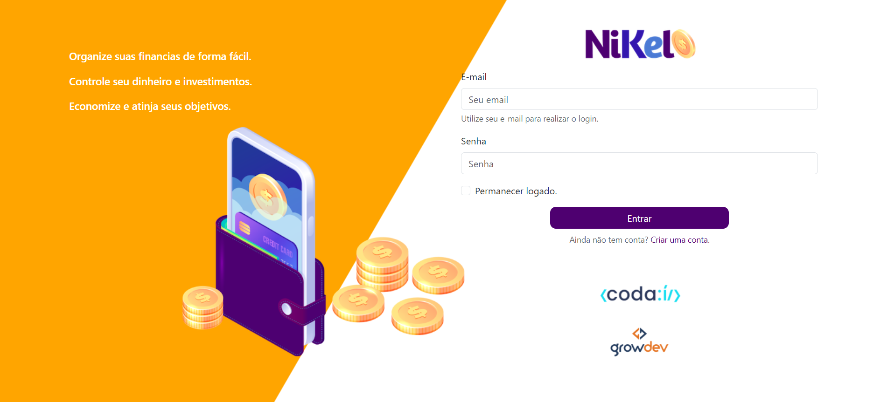
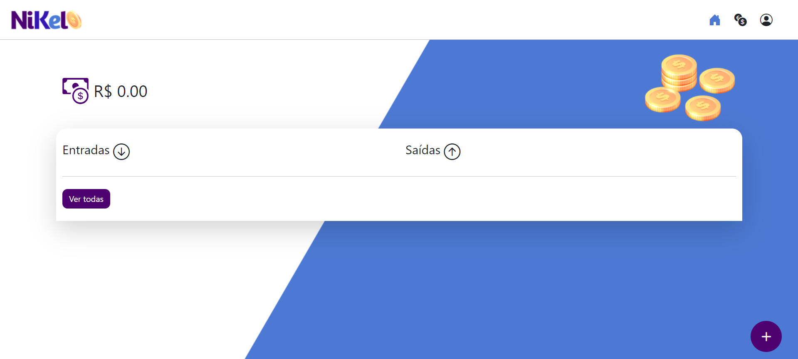
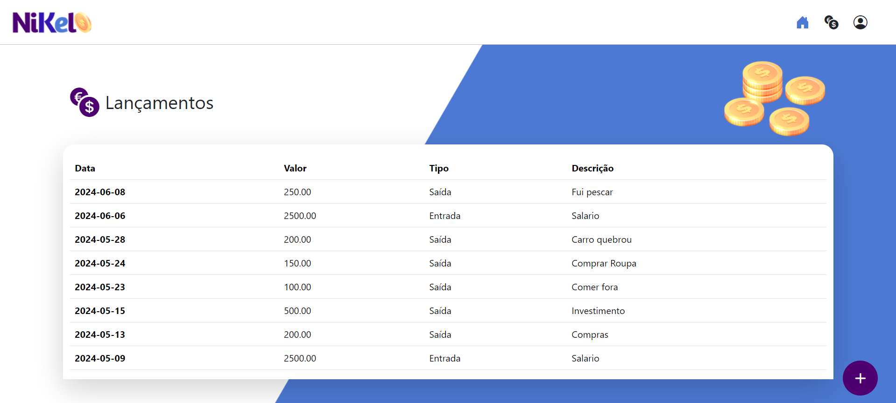
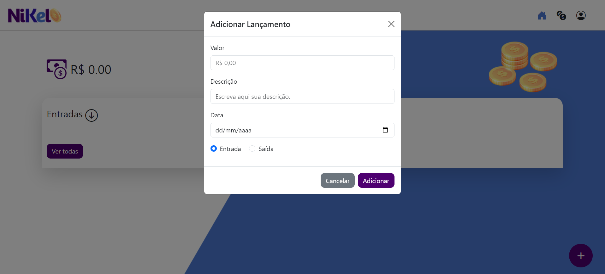

# Projeto-Níkel

Este trabalho aborda a criação de um sistema web para gerenciamento financeiro pessoal. A interface é projetada para ajudar os usuários a organizar suas finanças, controlar receitas e despesas, e visualizar transações financeiras. Aqui estão os principais componentes abordados no projeto:

Página de Login: Uma interface para que os usuários façam login no sistema usando seu e-mail e senha. Há também a opção de criar uma nova conta e a funcionalidade de permanecer logado.



Página Principal (Home): Após o login, o usuário é levado para a página principal, que exibe o saldo total, entradas e saídas recentes, e um botão para adicionar novas transações.



Página de Histórico de Transações: Uma tabela que mostra todas as transações do usuário, com detalhes como data, valor, tipo (entrada ou saída), e descrição.




Modal para Adicionar Transações: Um formulário que permite ao usuário adicionar uma nova transação com valor, descrição, data e tipo (entrada ou saída).



<hr>

<h3 align="center">Veja o deploy desta apresentação no seguinte link:</h3>

### Tecnologias usadas:

<div style="display: flex; gap: 10px">
    
    
    
    
    
    
</div>

## Como rodar o projeto localmente
1. Clone o repositório:

```bash
 https://github.com/JohannPDaniel/Projeto-FULL-STACK-1-GROWFLIX-.git
 ```
2. Navegue até a pasta do projeto:
```bash
cd projeto-nikel
```
3. Instale a extensão `Live Server` e aperte em `Go Live` localizado na parte inferior direita de seu computador.
## Contate me

<a href="https://wa.me/5519991069456">
    
</a>
<a href="https://www.linkedin.com/in/johann-patr%C3%ADcio-daniel-112425196/">
    
</a>