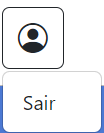

# Projeto-Níkel

Este trabalho aborda a criação de um sistema web para gerenciamento financeiro pessoal. A interface é projetada para ajudar os usuários a organizar suas finanças, controlar receitas e despesas, e visualizar transações financeiras. Aqui estão os principais componentes abordados no projeto:

Página de Login: Uma interface para que os usuários façam login no sistema usando seu e-mail e senha. Há também a opção de criar uma nova conta e a funcionalidade de permanecer logado.

Página Principal (Home): Após o login, o usuário é levado para a página principal, que exibe o saldo total, entradas e saídas recentes, e um botão para adicionar novas transações.

Página de Histórico de Transações: Uma tabela que mostra todas as transações do usuário, com detalhes como data, valor, tipo (entrada ou saída), e descrição.

Modal para Adicionar Transações: Um formulário que permite ao usuário adicionar uma nova transação com valor, descrição, data e tipo (entrada ou saída).

Funcionalidades Extras:

Um botão flutuante para adicionar rapidamente uma nova transação.

Um menu de navegação para alternar entre a página principal e a página de transações.

Um botão para sair da conta.

Estilos e Recursos:

Uso de Bootstrap para componentes responsivos e consistência visual.
Ícones do Bootstrap Icons para representar visualmente elementos do sistema.
Estrutura para integração de JavaScript, permitindo funcionalidades dinâmicas, como login, registro, logout e gerenciamento de transações.
Em resumo, este trabalho busca oferecer uma ferramenta prática e intuitiva para gestão financeira pessoal, com funcionalidades para entrada e saída de dinheiro, controle de saldo, e navegação fácil entre páginas. É um sistema robusto e expansível, ideal para quem deseja controlar melhor suas finanças.

### Tecnologias usadas:

    
    
    
    
    
    

